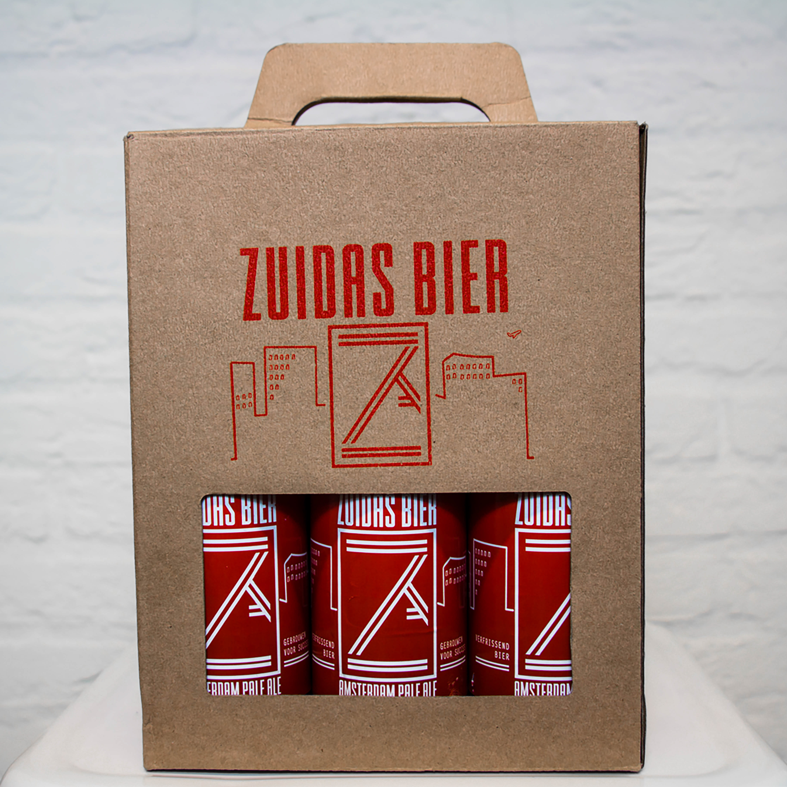
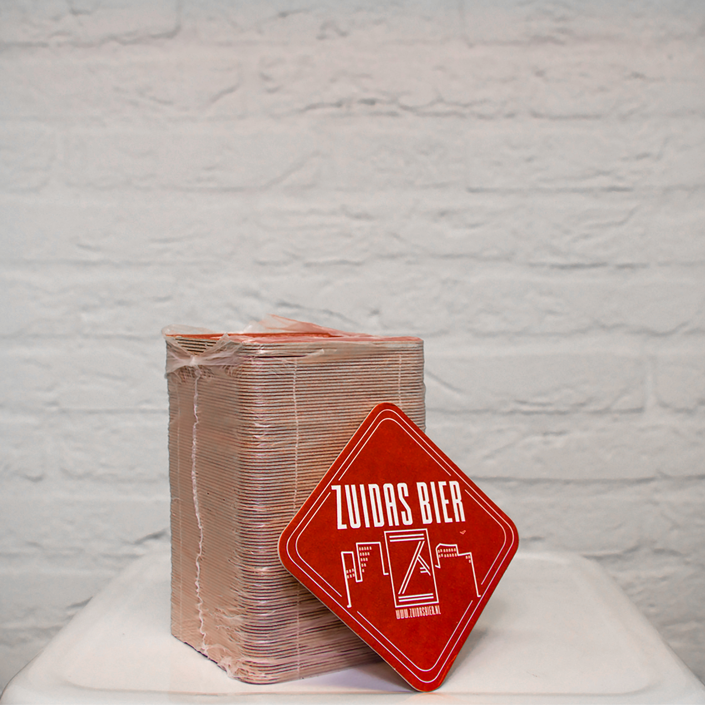
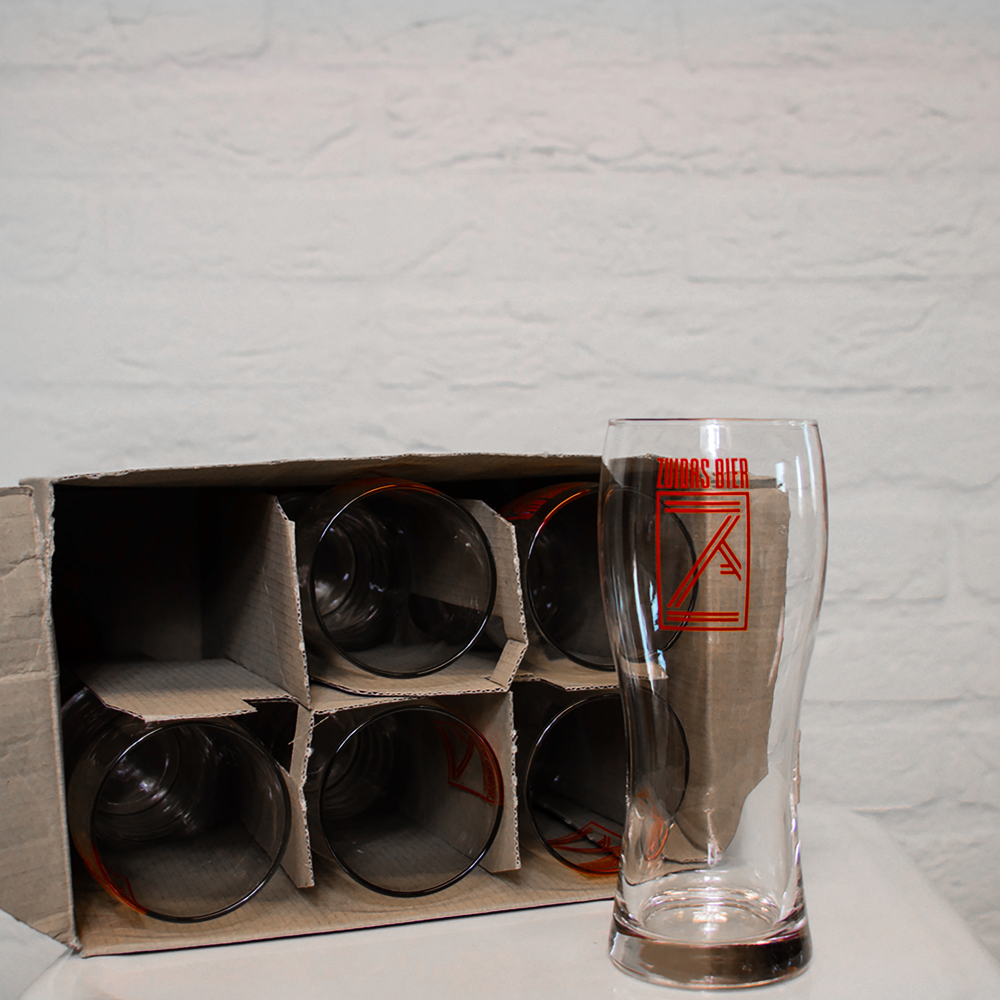

Voor opdracht twee heb ik een carrousel uitgewerkt. Deze is te bedienen via de buttons op de pagina, maar ook via de pijltjestoetsen op het toetsenbord.
Hierbij heb ik gewerkt vanuit de 3 Principles of User Interface Design.

One primary action per screen
Every screen we design should support a single action of real value to the person using it. This makes it easier to learn, easier to use, and easier to add to or build on when necessary. Screens that support two or more primary actions become confusing quickly. Like a written article should have a single, strong thesis, every screen we design should support a single, strong action that is its raison d'etre.

Er speelt 1 actie een grote rol op mijn pagina, het bewegen van de carrousel. Dit kan echter op twee manieren, door op de buttons te drukken of door de Arrow keys op het toetsenbord te gebruiken. 


Voor het werken van de Arrow Keys heb ik de volgende code gebruikt:

```js
document.addEventListener('keydown', (event) => {
  const keyName = event.key;
  if (event.key == 'ArrowRight'){
  	scrollnaarright()
  	// ga naar rechts
  } else if (event.key == 'ArrowLeft'){
  	// ga naar links
  	scrollnaarleft()
  }
});
```
Hierbij wordt de functie: scrollnaarright, aangeroepen zodra er op de ArrowRight wordt gedrukt. Bij ArrowLeft wordt de functie scrollnaarleft aangeroepen.

Over het volgende principle kreeg ik de feedback: Dat de gebruiker waarschijnlijk verwacht dat je van foto naar foto scrolld.

Provide a natural next step
Very few interactions are meant to be the last, so thoughtfully design a next step for each interaction a person has with your interface. Anticipate what the next interaction should be and design to support it. Just as we like in human conversation, provide an opening for further interaction. Don't leave a person hanging because they've done what you want them to do…give them a natural next step that helps them further achieve their goals.

Nu bestaat de code uit een transform van 400px. 


```js
var buttonterug = document.querySelector('.terug');
var buttonverder = document.querySelector('.verder');
var verschuiven = document.querySelector('.beelden');

buttonverder.addEventListener("click", scrollnaarright); // laat de sectie:beelden naar rechts verschuiven als er op de button gedrukt wordt

function scrollnaarright(){
	var positie = verschuiven.getBoundingClientRect(); //hierdoor wordt er gekeken naar de positie zodra de sectie:beelden verschuifd
	if( positie.x < -1700){ // als de positie groter is dan -1700px, moet de sectie stoppen met verschuiven
		verschuiven.style.transform += 'translateX(0)';
	}
	else{
		console.log("ik kom hier" + verschuiven)
		verschuiven.style.transform += `translateX(-400px)`; //is hij niet groter dan -1700px, verschuifd de sectie met -400px
	}
}

buttonterug.addEventListener("click", scrollnaarleft); // laat de sectie:beelden naar links verschuiven als er op de button gedrukt wordt

function scrollnaarleft(){
	var positie = verschuiven.getBoundingClientRect(); //hierdoor wordt er gekeken naar de positie zodra de sectie:beelden verschuifd
	if( positie.x > -8){ // als de positie groter is dan -8px, moet de sectie stoppen met verschuiven
		verschuiven.style.transform += 'translateX(0)';
	}
	else {
	verschuiven.style.transform += 'translateX(400px)'; //als hij niet groter is dan -8px, verschuifd de sectie met 400px
}
}

```

Als ik de transform aanpas naar de width van de afbeelding, zal er van afbeelding naar afbeelding worden gescrolld. 
De width van de afbeelding, samen met de bijbehorende padding en margin is 733px. Ik verander -400 naar -733, en bij de scrollnaarleft verandere ik de 400px in 733px.

Naast de grootte waarmee de verschuiving wordt gemaakt moet ik ook de waarde veranderen van wanneer de carrousel moet stoppen met bewegen. Deze waarde is op dit moment -1700. Daar tel ik 733px bij op, -2433. 

Dit geeft het volgende effect:


Omdat alle afbeeldingen nu met 733px verschuiven, ontstaat er bij de laatste foto een zwart vlak naast de foto. Dit komt omdat ik de waarde van de positie naar -2433 heb gezet.

Dan is blijft er nog de laatste principe over:

Progressive disclosure
Show only what is necessary on each screen. If people are making a choice, show enough information to allow them the choice, then dive into details on a subsequent screen. Avoid the tendency to over-explain or show everything all at once. When possible, defer decisions to subsequent screens by progressively disclosing information as necessary. This will keep your interactions more clear.

Ook hier kwam uit de feedback naar voren dat ik dit al goed in mijn pagina had verwerkt. De pagina bestaat alleen uit de carrousel en uit de buttons die de carrousel bedienen. De gebruiker krijgt feedback zodra hij over de buttons hoverd. 


(Omdat tijdens het maken van de gif, de muis wordt weg gelaten heb ik er een < toets over heen gegooid. Zodat je kan zien wanneer er gehoverd wordt.)

Daarnaast zit er ook een leuke hover over de afbeeldingen in de carrousel. 


(Omdat tijdens het maken van de gif, de muis wordt weg gelaten heb ik er een < toets over heen gegooid. Zodat je kan zien wanneer er gehoverd wordt.)

De hover van de afbeeldingen heb ik met html en css gemaakt.

```
<section class="beelden">
					<div class="overlaycon">
						
						<div class="overlay">
							
						</div>
					</div>
					<div class="overlaycon">
						
						<div class="overlay">
							
						</div>
					</div>
					<div class="overlaycon">
						
						<div class="overlay">
							
						</div>
					</div>
					<div class="overlaycon">
						
						<div class="overlay">
							
						</div>
					</div>
					<div class="overlaycon">
						
						<div class="overlay">
							
						</div>
					</div>
		</section>
```
De afbeeldingen zitten in de section class beelden, die wordt aangeroepen in de functie om alle afbeeldingen te laten bewegen. Verder zitten de 2 afbeeldingen die bij elkaar horen in 1 class. 1 "normale" afbeelding & de hover versie. Via deze css wordt de hover geactiveerd: 

```css
.overlaycon{
  position: relative;
}

.overlay {
  position: absolute;
  top: 0;
  bottom: 0;
  left: 0;
  right: 0;
  opacity: 0;
  transition: .3s ease;
}

.overlaycon:hover .overlay {
  opacity: 1;
}

.image {
	width: 693px;
	height: 693px;
}
```
